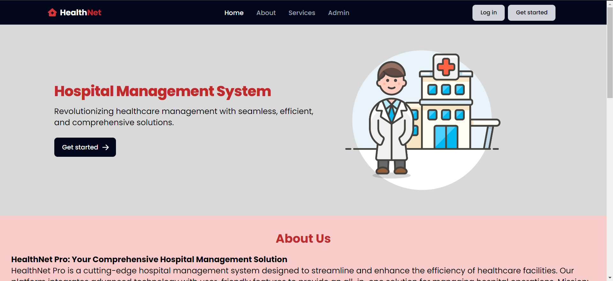

# [HealthNet](https://healthnet-frontend.onrender.com/)

 
 
HealthNet is a cutting-edge hospital management system designed to streamline and enhance the efficiency of healthcare facilities. Our platform integrates advanced technology with user-friendly features to provide an all-in-one solution for managing hospital operations. 
 
 
**Mission**: Our mission is to revolutionize healthcare management by offering a robust, reliable, and intuitive system that improves patient care, optimizes administrative workflows, and ensures seamless communication across departments.
 
 
**Tech Stack:**
 
React JS, Tailwind CSS, Flowbite JS, Node JS, Express JS, Mongo DB
 
 
**APIs used:** NewsAPI and Calenderific
 
 
**Features:**
 
1. Responsive UI
2. Keeps a track of doctors and patients
3. Provides latest medical/hospital updates
4. Keeps a track of earnings through React charts
5. Keeps a track of patient appointments
6. Interactive Dashboard
7. Manages hospital analytics
8. Maintains doctor attendance